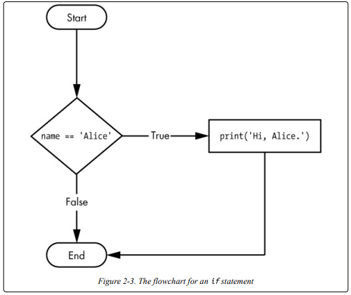
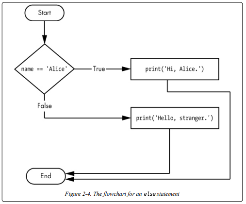

# Lesson 2 - Flow Control 

1. Boolean Values 
   1. spam = True / spam = False
2. Comparison Operators 
 
| Operator | Meaning                  |
|----------|--------------------------|
| ==       | Equal to                 |
| !=       | Not equal to             |
| <        | Less than                |
| \>       | Greater than             |
| <=       | Less than or equal to    |
| \>=      | Greater than or equal to |

3. boolean Operators  
   1.The and Operator's Truth Table

| Expression      | Evaluates to |
|-----------------|--------------|
| True and True   | True         |
| True and False  | False        |
| False and True  | False        |
| False and False | False        |

  2.The or Operator's Truth Table 
  
| Expression      | Evaluates to |
|-----------------|--------------|
| True and True   | True         |
| True and False  | True         |
| False and True  | True         |
| False and False | False        |

  3.The not Operator's Truth Table 
  
| Expression | Evaluates to |
|-----------|--------------|
| not True  | False        |
| not False | True         |

4. If Statements: An ''if'' statement’s clause (that is, the block following the if statement) will
execute if the statement’s condition is True. The clause is skipped if the
condition is False: 

5. Else Statements: The else clause is executed only when the ''if'' statement's condition is False. So, (if this condition is true execute this code. Or else, execute that code):

6. While Loop Statements: The code in a While clause will be executed as long as the while statement's condition is True: 

