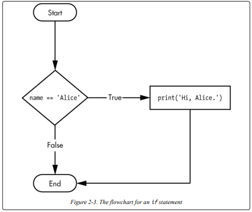
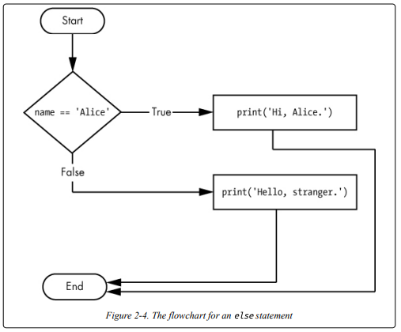
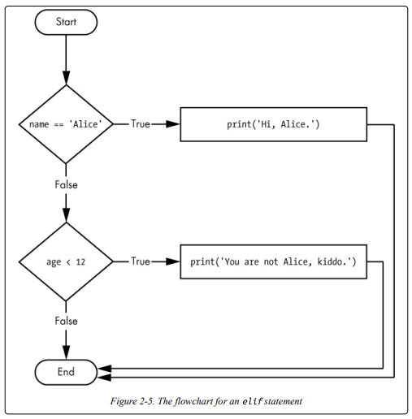
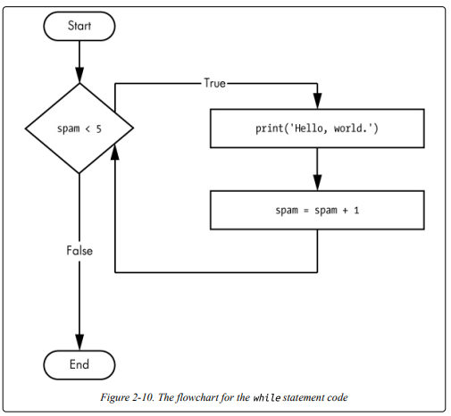
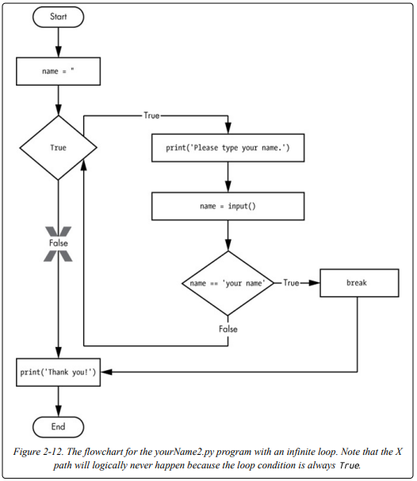
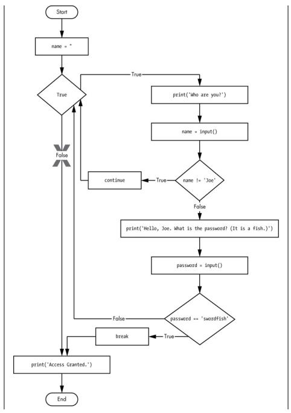
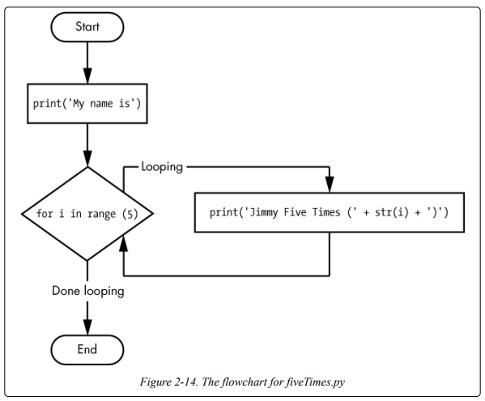

# Lesson 2 - Flow Control 

1. Boolean Values 
   1. spam = True / spam = False
2. Comparison Operators 
 
| Operator | Meaning                  |
|----------|--------------------------|
| ==       | Equal to                 |
| !=       | Not equal to             |
| <        | Less than                |
| \>       | Greater than             |
| <=       | Less than or equal to    |
| \>=      | Greater than or equal to |

3. boolean Operators  
   a. The and Operator's Truth Table

| Expression      | Evaluates to |
|-----------------|--------------|
| True and True   | True         |
| True and False  | False        |
| False and True  | False        |
| False and False | False        |

   b. The or Operator's Truth Table 

| Expression      | Evaluates to |
|-----------------|--------------|
| True and True   | True         |
| True and False  | True         |
| False and True  | True         |
| False and False | False        |

  c. The not Operator's Truth Table 
  
| Expression | Evaluates to |
|-----------|--------------|
| not True  | False        |
| not False | True         |

4. *If* Statements: An ''if'' statement’s clause (that is, the block following the if statement) will
execute if the statement’s condition is True. The clause is skipped if the
condition is False.

5. *Else* Statements: The else clause is executed only when the ''if'' statement's condition is False. So, (if this condition is true execute this code. Or else, execute that code).

6. *Elif* Statements: The elif statement is an 'else + if' statement that always an if or another elif statement. 

OBS: So, if in the first try name is different from Alice, it goes to the second try, otherwise it ends the statements. 

7. *While* Loop Statements: The code in a While clause will be executed as long as the while statement's condition is True.

8. *Break* Statements: If the execution reaches a break statement, it immediately exits the while loop's clause, in code, a break statement simply contains the break keyword.

9. *Continue* Statements: Like break statements, continue statements are used inside loops. When the program execution reaches a continue statement, the program execution immediately jumps back to the start of the loop and reevaluates.

10. *for* Loops and the range() Function: we can execute a block certain number of times.

   a. range(): 

      range(12,16): 12 13 14 15

      range(0,10,2): 0 2 4 6 8 10   

      range(5,-1,-1): 5 4 3 2 1 0

11. Importing Modules:  Python also comes with a set of modules called the standard library. Each module is a Python program that contains a related group of functions that can be embedded in your programs. For example, the math module has mathematics-related functions, the random module has random
number–related functions, and so on.